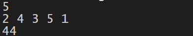
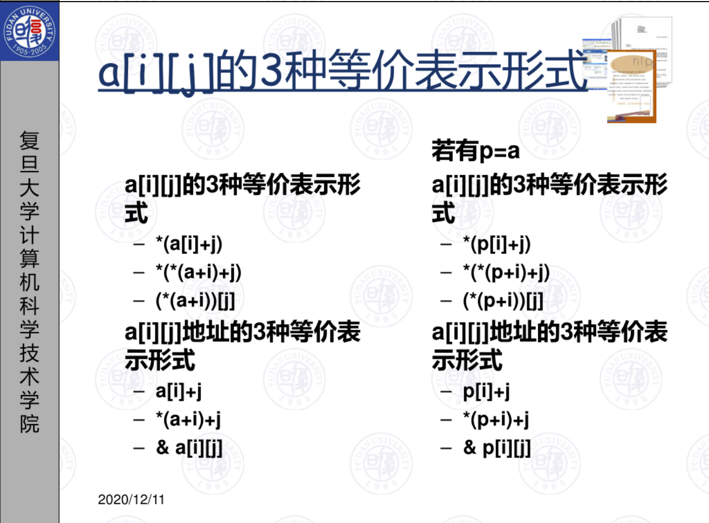

# lab13

>本节目标：
>
>1. 学习强化指针的使用。
>2. 了解指针与数组的关系
>3. 回顾include

获取及提交lab
-------
获取：通过 https://github.com/C-FUDAN-2020/lab13 获取。

提交物：将你完成思考题的文档，编程题的代码作为 lab13 的提交物。

提交：按照要求提交至超星学习通对应的作业题目中。

截止时间：北京时间 2020年12月20日 23:59:59

## 思考题目

> 请提交书面答案的文档

#### 指针的使用
学习了指针的小明同学，跃跃欲试。他想用指针而不是数组解决实际问题，因为这样看起来很酷（~~助教也觉得的确很酷~~）。他现在需要解决如下题目：

> 输入：数组的长度和数组每个元素的值（数组长度和数组元素都可以使用int进行存储）

> 输出：排序前后对应位置元素的乘积和    



机智小明很快写下了如下代码。但这个代码有3个bug，请帮他找到，并提供解决方法（同类型bug算一个）。

```c
#include <stdio.h>
int* sort(int*);

int main(){
    int count, sum = 0, *arr;
    scanf("%d",&count);
    for(int i = 0; i < count; i++){
        scanf("%d", arr + i);
    }
    int *sorted = sort(arr);
    for(int i = 0; i < count; i++){
        sum += arr[i] * sorted[i];
    }
    printf("%d",sum);
    return 0;
}

int* sort(int* arr){
    int *sorted, len;
    len = sizeof(arr)/sizeof(arr[0]);
    // copy
    for(int i = 0; i < len; i++){
        sorted[i] = arr[i];
    }
    // selection sort
    int min_value, min_pos, temp;
    for(int i = 0; i < len; i++){
        min_value = sorted[i];
        min_pos = i;
        for(int j = i + 1; j < len; j++){
            if(sorted[j] < sorted[i]){
                min_value = sorted[j];
                min_pos = j;
            }
        }
        temp = sorted[i];
        sorted[i] = sorted[min_pos];
        sorted[min_pos] = temp;
    }
    return sorted;
}
```
#### 指针与数组
> &emsp;&emsp;孔乙己等了许久，很恳切的说道，“不能写罢？……我教给你，记着！这些字应该记着。将来做掌柜的时候，写账要用。”我暗想我和掌柜的等级还很远呢，而且我们掌柜也从不将茴香豆上账；
> 又好笑，又不耐烦，懒懒的答他道，“谁要你教，不是草头底下一个来回的回字么？”孔乙己显出极高兴的样子，将两个指头的长指甲敲着柜台，点头说，“对呀对呀！……回字有四样写法，你知道么？”
> 我愈不耐烦了，努着嘴走远。孔乙己刚用指甲蘸了酒，想在柜上写字，见我毫不热心，便又叹一口气，显出极惋惜的样子。（~~文题无关~~）
所以大家还记得数组`a[i][j]`的三种等价表示形式吗？

